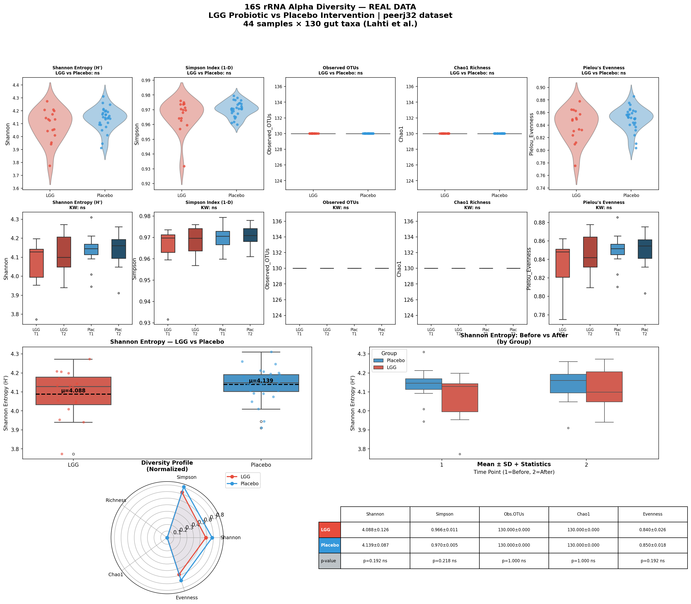

# Day 01 — 16S rRNA Alpha Diversity Analysis
### 🧬 30 Days of Bioinformatics | Subhadip Jana


> Alpha diversity analysis of real human gut microbiome data comparing **LGG probiotic** vs **Placebo** groups across two time points.

---

## 📊 Dashboard


---

## 🔬 Dataset — peerj32
| Feature | Value |
|---------|-------|
| Samples | 44 |
| Taxa | 130 gut bacteria |
| Groups | LGG probiotic (16) vs Placebo (28) |
| Time points | Before (T1) vs After (T2) intervention |
| Source | microbiome R package (Lahti et al.) |

---

## 📈 Metrics Computed
| Metric | Description |
|--------|-------------|
| **Shannon Entropy** | Overall richness + evenness |
| **Simpson Index** | Dominance probability |
| **Observed OTUs** | Raw species richness |
| **Chao1** | Estimated true richness |
| **Pielou's Evenness** | Distribution uniformity |

---

## 📊 Key Results

| Group | Shannon | Simpson | Evenness |
|-------|---------|---------|----------|
| LGG | 4.088 | 0.966 | 0.840 |
| Placebo | 4.139 | 0.970 | 0.850 |

**Finding:** No significant difference in alpha diversity between LGG and Placebo groups (p>0.05). This is biologically meaningful — LGG probiotic did not significantly alter overall gut microbiome diversity, consistent with its known targeted mechanism of action.

---

## 🚀 How to Run
```bash
pip install pandas numpy matplotlib seaborn scipy
python alpha_diversity.py
```

---

## 📁 Structure
```
day01-alpha-diversity/
├── alpha_diversity.py
├── data/
│   ├── otu_table.csv
│   └── metadata.csv
├── outputs/
│   ├── alpha_diversity_results.csv
│   └── alpha_diversity_dashboard.png
└── README.md
```

---

## 🔗 Part of #30DaysOfBioinformatics
**Author:** Subhadip Jana | [GitHub](https://github.com/SubhadipJana1409) | [LinkedIn](https://linkedin.com/in/subhadip-jana1409)
